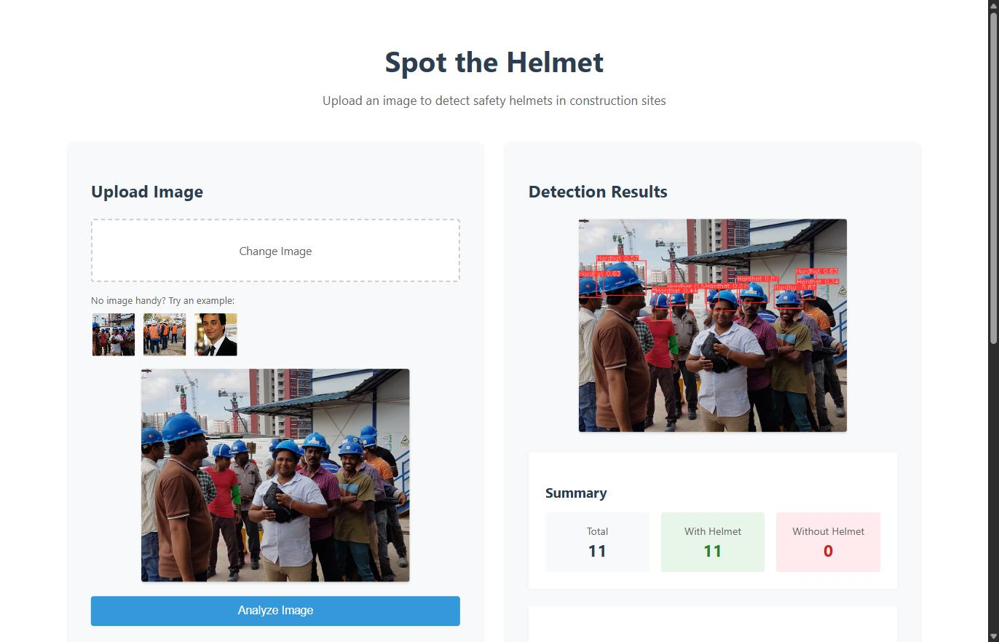
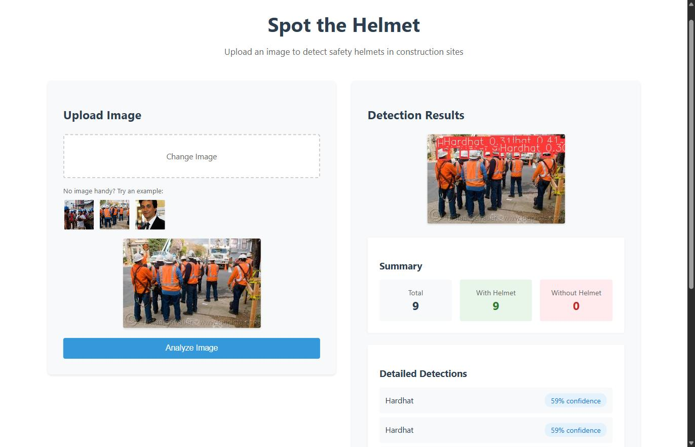
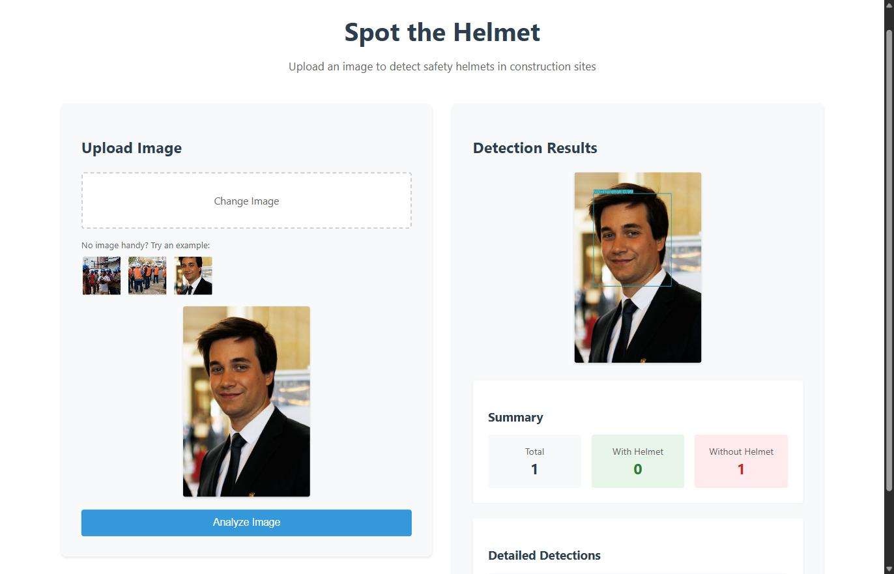
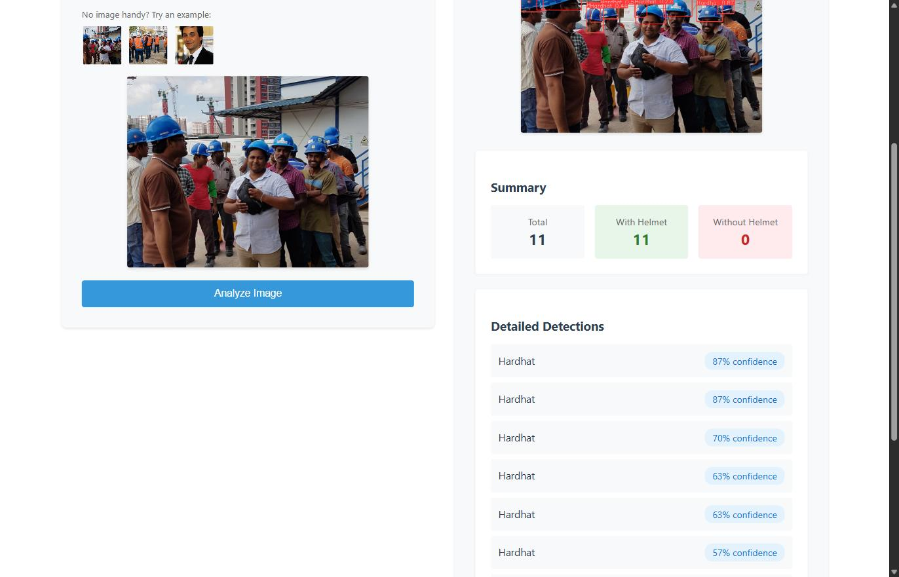

# Spot the Helmet! 🪖

A real-time helmet detection application that uses computer vision to identify whether people are wearing hard hats in images. Built with React, Node.js, and YOLOv8.

| With helmets | With helmets (2) | No helmet |
|---|---|---|
|  |  |  |



## Features

- Upload images for helmet detection
- Real-time processing using YOLOv8
- Visual display of detections with bounding boxes
- Detailed detection results including confidence scores
- Count of people with and without helmets

## Tech Stack

- **Frontend**: React.js
- **Backend**: Node.js + Express
- **Image Processing**: Python + YOLOv8
- **Containerization**: Docker + Docker Compose

## Prerequisites

- Docker and Docker Compose
- Git

## Setup Instructions

1. Clone the repository:
```bash
git clone https://github.com/liorperlman/spot-the-helmet.git
cd spot-the-helmet
```

2. Create a shared volume for image storage:
```bash
mkdir -p shared/uploads
```

3. Build and start the containers:
```bash
docker-compose up --build
```

4. Access the application:
- Frontend: http://localhost:3000
- Backend API: http://localhost:5000
- Processor Service: http://localhost:5001

## Project Structure

```
spot-the-helmet/
├── frontend/               # React frontend application
│   └── src/
│       ├── components/    # React components
│       │   ├── ImageUploader.js
│       │   └── ResultViewer.js
│       └── App.js         # Main application component
├── backend/               # Node.js backend service
│   ├── routes/           # API routes
│   └── services/         # Business logic
├── processor/            # Python image processing service
│   ├── app.py           # Flask application
│   └── detect.py        # YOLO detection logic
├── shared/              # Shared volume for image storage
│   └── uploads/         # Uploaded images
│       └── detections/  # Processed images
├── docker-compose.yml   # Docker Compose configuration
├── Dockerfile.backend
├── Dockerfile.frontend
└── Dockerfile.processor
```

## API Endpoints

### Backend API (http://localhost:5000)

- `POST /api/upload`
  - Upload an image for processing
  - Returns detection results and annotated image URL

### Processor Service (http://localhost:5001)

- `POST /process`
  - Process an image using YOLOv8
  - Returns detection metadata and saves annotated image

## How It Works

1. User uploads an image through the frontend
2. Backend receives the image and forwards it to the processor service
3. Processor service uses YOLOv8 to detect helmets
4. Annotated image is saved and detection results are returned
5. Frontend displays the results and annotated image

## Model Details

The application uses the `keremberke/yolov8n-hard-hat-detection` model from Hugging Face, which is specifically trained to detect:
- Hardhats
- People without hardhats

## Development

### Adding New Features

1. Frontend changes:
```bash
cd frontend
npm install
npm start
```

2. Backend changes:
```bash
cd backend
npm install
npm start
```

3. Processor changes:
```bash
cd processor
pip install -r requirements.txt
python app.py
```

### Rebuilding Containers

After making changes to any service:
```bash
docker-compose down
docker-compose up --build
```

## Design Decisions

### Architecture
- **Frontend**: React-based SPA for fast, responsive user experience
- **Backend**: Node.js/Express handles uploads and routing; a separate
  Python/Flask microservice runs the YOLOv8 image processing

### UI/UX Principles
1. **Minimalist Design**
   - Clean, uncluttered interface
   - Focus on the task at hand
   - Clear visual hierarchy

2. **User Feedback**
   - Immediate response to user actions
   - Clear loading states
   - Informative error messages
   - Visual confirmation of successful operations

## Troubleshooting

1. If images aren't being processed:
   - Check if the shared volume is properly mounted
   - Verify all services are running (`docker-compose ps`)
   - Check service logs (`docker-compose logs`)

2. If the frontend can't connect to the backend:
   - Ensure all services are running
   - Check if the ports are correctly mapped
   - Verify CORS settings in the backend

3. If detection results are poor:
   - Try adjusting the confidence threshold in `processor/detect.py`
   - Check if the image quality is sufficient
   - Consider using a different pre-trained model

## Contributing

1. Fork the repository
2. Create a feature branch
3. Commit your changes
4. Push to the branch
5. Create a Pull Request

## Acknowledgments

- YOLOv8 by Ultralytics
- Hard hat detection model by keremberke
- React and Node.js communities 